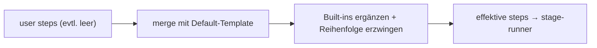

← [engine](../_engine.md)

# resolve-steps

Bereitet die `steps`-Liste einer Stage vor dem Lauf auf: setzt die Built-in-
Defaults aus dem Default-Template ein, erzwingt deren kanonische Reihenfolge und
merged `instructions`. Hier — nicht im [step-Schema](../../schema/_schema.md) —
lebt die Built-in-Semantik.

## Was

- Eingabe: die (ggf. leere/teilweise) `steps` der Stage + der Default-Template-
  Eintrag für diese Tier/Stage. Ausgabe: die effektive, geordnete Step-Liste.
- Fehlende **mandatory Built-ins** werden an ihrer kanonischen Position ergänzt
  (nicht entfernbar); custom Steps interleaven dazwischen.
- Built-ins behalten ihre relative Reihenfolge (z.B. `task-validate` nie vor
  `implement`); ein reservierter Name mit `run`/`use` → Fehler.
- `instructions` am Built-in werden an dessen Default-Brief **angehängt**
  (extend-only).

## Wie

## Warum

Trennt Mechanik (welche Built-ins, welche Reihenfolge — fix) von Policy (eigene
Steps + instructions — frei). Anfänger schreiben nichts und kriegen die kanonische
Sequenz; Power-User interleaven, ohne die Built-ins entfernen zu können.
