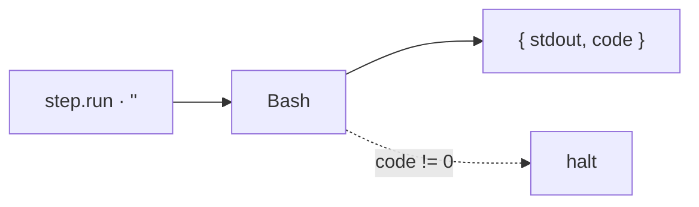

← [engine](../_engine.md)

# run-step

Helfer für einen Step mit `run:` — führt das Shell-Kommando über Bash aus und gibt
stdout/Exit-Code zurück. Der einfachste Step-Typ.

## Was

- Eingabe: ein Step mit `run: '<cmd>'`. Ausgabe: `{ stdout, code }`.
- Non-zero Exit → der [stage-runner](../stage-runner.md) hält die Stage an.
- Variablen-Kontext (z.B. `TASK_SLUG`, `PHASE_SLUG`) wird ins Env gereicht.

## Wie

