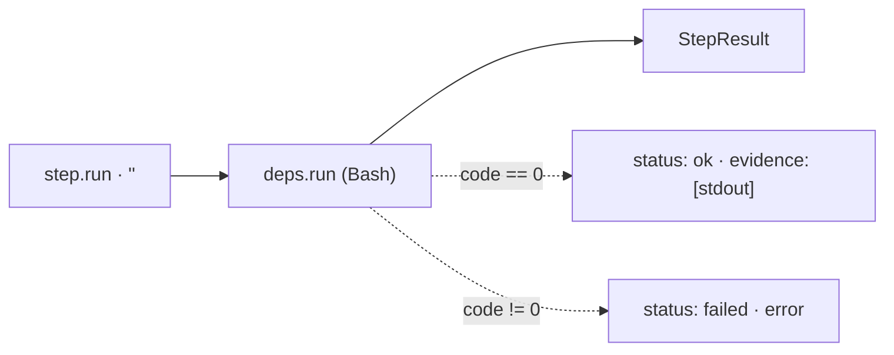

← [engine](../_engine.md)

# run-step

Helper for a step with `run:` — executes the shell command via the injected
`run` seam (Bash) and returns the canonical `StepResult`. The simplest
step type: a pure run, exit 0 → `ok`, non-zero → `failed`.

## What

- Input: a step with `run: '<cmd>'`. Output: `StepResult`
  (`{ node, status, evidence }` on success · `{ node, status: 'failed', error }`
  on non-zero exit).
- Exit 0 → `status: 'ok'`, stdout (if present) is passed through as `evidence`.
- Non-zero exit → `status: 'failed'`, `stderr` (or `exit <code>`) as `error`.

## How

