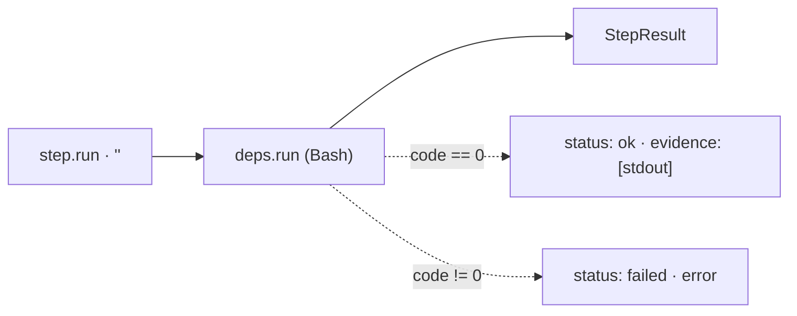

← [engine](../_engine.md)

# run-step

Helfer für einen Step mit `run:` — führt das Shell-Kommando über die injizierte
`run`-Naht (Bash) aus und gibt das kanonische `StepResult` zurück. Der einfachste
Step-Typ: ein reiner Run, Exit 0 → `ok`, non-zero → `failed`.

## Was

- Eingabe: ein Step mit `run: '<cmd>'`. Ausgabe: `StepResult`
  (`{ node, status, evidence }` bei Erfolg · `{ node, status: 'failed', error }`
  bei non-zero Exit).
- Exit 0 → `status: 'ok'`, stdout (falls vorhanden) wird als `evidence` gereicht.
- Non-zero Exit → `status: 'failed'`, `stderr` (bzw. `exit <code>`) als `error`.

## Wie

