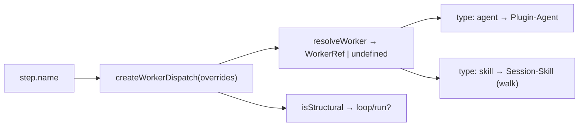

← [engine](../_engine.md)

# worker-dispatch

The **only place that knows built-in step names** — maps a step `name`
to its worker ref (`agent` | `skill`). The engine *never* hardcodes step names;
it dispatches config-driven and asks here for the worker. Policy/data,
injectable (overrides).

## What

- **`DEFAULT_WORKERS`** — the name→ref table from the default template + agent roster:
  `implement→build-implement`, `task-validate→build-task-validate`,
  `code-validate→build-code-validate`, `discover→plan-discover`,
  `rules-scan→plan-rules-scan`, `decompose→plan-decompose`,
  `plan-check→refine-plan-check`, `rules-check→refine-rules-check`,
  `walk→walk` (**type `skill`**, no agent), `review→wrap-review`,
  `summarize→wrap-summarize`, `scaffold→epic-scaffold`, `roll-up→epic-roll-up`.
- **`STRUCTURAL`** — `{ loop, run }`: handled by the engine *itself*, no workers.
- The workers themselves are plugin agents (Task plugin-agents); here lives **only** the
  name→ref mapping.

## How

`createWorkerDispatch(overrides?) → { resolveWorker, isStructural, names }`. Overrides
merge over the defaults (user wins).

> Note in the code: `rules-scan` (task.plan) maps to a `plan-rules-scan` agent,
> which the agent roster still has to add (so far it only lists `refine-rules-check`)
> — flagged for Task plugin-agents.

## Why

Keeps the engine free of concrete step names ([resolve-steps](resolve-steps.md)
inserts the built-in defaults, this module knows their workers) — new built-ins
change only this one table, not the control flow.
