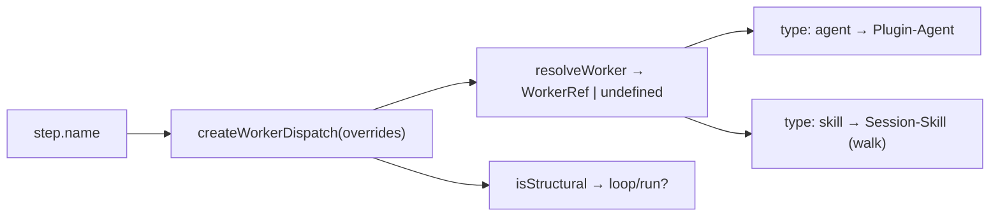

← [engine](../_engine.md)

# worker-dispatch

Die **einzige Stelle, die Built-in-Step-Namen kennt** — mappt einen Step-`name`
auf seinen Worker-Ref (`agent` | `skill`). Die Engine hardcodet *nie* Step-Namen;
sie dispatcht config-getrieben und fragt hier nach dem Worker. Policy/Daten,
injizierbar (Overrides).

## Was

- **`DEFAULT_WORKERS`** — die name→ref-Tabelle aus Default-Template + Agent-Roster:
  `implement→build-implement`, `task-validate→build-task-validate`,
  `code-validate→build-code-validate`, `discover→plan-discover`,
  `rules-scan→plan-rules-scan`, `decompose→plan-decompose`,
  `plan-check→refine-plan-check`, `rules-check→refine-rules-check`,
  `walk→walk` (**type `skill`**, kein Agent), `review→wrap-review`,
  `summarize→wrap-summarize`, `scaffold→epic-scaffold`, `roll-up→epic-roll-up`.
- **`STRUCTURAL`** — `{ loop, run }`: vom Engine *selbst* gehandhabt, keine Worker.
- Die Worker selbst sind Plugin-Agents (Task plugin-agents); hier liegt **nur** das
  Name→Ref-Mapping.

## Wie

`createWorkerDispatch(overrides?) → { resolveWorker, isStructural, names }`. Overrides
mergen über die Defaults (User gewinnt).

> Hinweis im Code: `rules-scan` (task.plan) mappt auf einen `plan-rules-scan`-Agent,
> den der Agent-Roster noch ergänzen muss (er listet bisher nur `refine-rules-check`)
> — für Task plugin-agents vorgemerkt.

## Warum

Hält die Engine frei von konkreten Step-Namen ([resolve-steps](resolve-steps.md)
setzt die Built-in-Defaults ein, dieses Modul kennt ihre Worker) — neue Built-ins
ändern nur diese eine Tabelle, nicht den Kontrollfluss.
