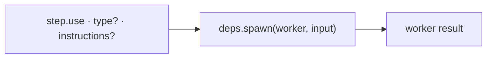

← [engine](../_engine.md)

# worker-step

Helfer für einen Step mit `use:` — triggert einen AI-Worker über `deps.spawn`.
Das ist die **einzige** Stelle, an der die Engine AI aufruft.

## Was

- Eingabe: ein Step mit `use: '<worker>'`, optional `type: agent|skill` (default
  `agent`) und `instructions`. Ausgabe: das Worker-Ergebnis.
- `type: agent` → isolierter Subagent; `type: skill` → in der Orchestrator-
  Session. `instructions` werden an den Worker durchgereicht.
- Läuft über `deps.spawn` → im Test durch ein Fake ersetzbar, ohne echtes Claude.

## Wie

## Warum

`spawn` als injizierte Naht entkoppelt die Engine vom Ausführungs-Substrat —
heute `claude -p`/Subagent, morgen austauschbar, ohne die Runner zu ändern.
