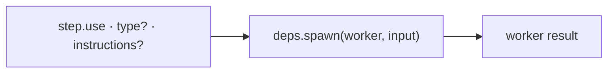

← [engine](../_engine.md)

# worker-step

Helper for a step with `use:` — triggers an AI worker via `deps.spawn`.
This is the **only** place where the engine calls AI.

## What

- Input: a step with `use: '<worker>'`, optionally `type: agent|skill` (default
  `agent`) and `instructions`. Output: the worker result.
- `type: agent` → isolated subagent; `type: skill` → in the orchestrator
  session. `instructions` are passed through to the worker.
- Runs via `deps.spawn` → swappable for a fake in the test, without real Claude.

## How

## Why

`spawn` as an injected seam decouples the engine from the execution substrate —
today `claude -p`/subagent, tomorrow swappable, without changing the runner.
