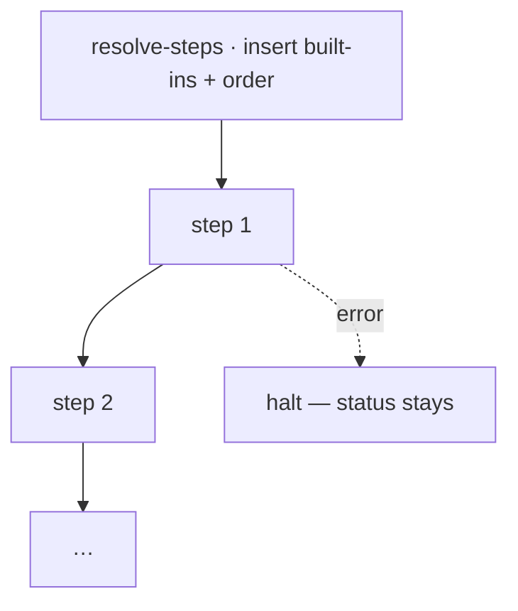

← [engine](_engine.md)

# stage-runner

Runs the `steps` of **one** stage in declaration order. Beforehand, it inserts
the built-in defaults via [resolve-steps](scope/resolve-steps.md) and halts as
soon as a step fails.

## What

- `createStageRunner(cfg, deps) → { run(node) → result }`.
- Order = entry order of the `steps`; each step via
  [step-runner](step-runner.md).
- Stop on failure (non-zero / worker error) — the tier status stays put,
  a re-run resumes.
- Built-ins are not removable; missing ones are added at their canonical
  position in `resolve-steps`, custom steps interleave in between.

## How

`createStageRunner(cfg, deps): { run(node: Node) => Promise<Result> }`

