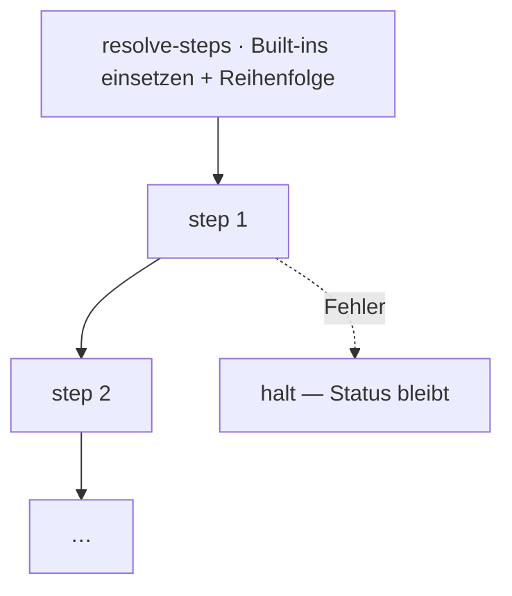

← [engine](_engine.md)

# stage-runner

Fährt die `steps` **einer** Stage in Deklarations-Reihenfolge. Setzt vorher per
[resolve-steps](scope/resolve-steps.md) die Built-in-Defaults ein und hält an,
sobald ein Step fehlschlägt.

## Was

- `createStageRunner(cfg, deps) → { run(node) → result }`.
- Reihenfolge = Eintragungsreihenfolge der `steps`; jeder Step via
  [step-runner](step-runner.md).
- Halt bei Fehler (non-zero / Worker-Error) — der Tier-Status bleibt stehen,
  Re-Run setzt fort.
- Built-ins sind nicht entfernbar; fehlende werden in `resolve-steps` an ihrer
  kanonischen Position ergänzt, eigene Steps interleaven dazwischen.

## Wie

`createStageRunner(cfg, deps): { run(node: Node) => Promise<Result> }`

