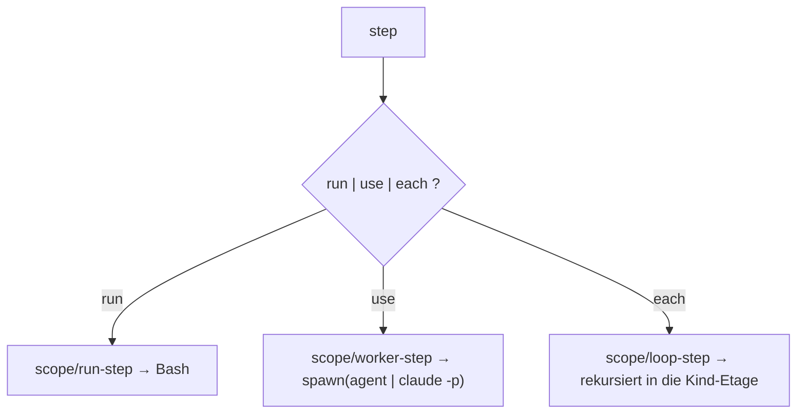

← [engine](_engine.md)

# step-runner

Führt **einen** Step aus. Dispatcht anhand der Step-Form auf einen der drei
Helfer: `run` → Bash, `use` → Worker, `each` → Loop (Rekursion). Die Step-Form
ist strukturell ([schema/step](../schema/_schema.md)); die Built-in-Semantik
lebt in [resolve-steps](scope/resolve-steps.md), nicht hier.

## Was

- `createStepRunner(cfg, deps) → { run(step, node) → output }`.
- Genau eines greift: `run:` (Shell), `use:` (`agent|skill`-Worker), `each:`
  (Loop über die Kind-Etage). `run` XOR `use` ist strukturell erzwungen.
- `instructions` werden an Worker/Built-in durchgereicht; `involve` nur am
  `walk`.

## Wie

`createStepRunner(cfg, deps): { run(step: Step, node: Node) => Promise<Output> }`

