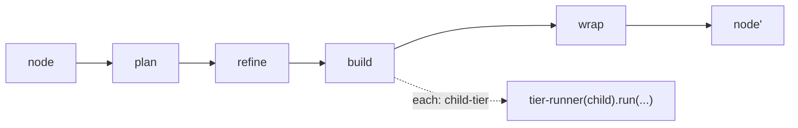

← [engine](_engine.md)

# tier-runner

Fährt einen Knoten durch seine vier Stages `plan → refine → build → wrap`.
**Eine** Funktion bedient alle Etagen (epic/task/phase) — der Unterschied ist nur
der `cfg` (aus `anchored.yml`) und der `node` (die Daten). Das ist der fraktale
Kern.

## Was

- `createTierRunner(cfg, deps) → { run(node) → result }`.
- Fährt die Stages in fester Reihenfolge und schreibt den Tier-Status über
  `deps.ops` fort (forward-only, siehe [validate](../validate/_validate.md)).
- `phase` ist der Leaf: dessen `build` hat kein `each`, läuft also einmal
  (echte Arbeit). Bei `task`/`epic` rekursiert `build` über `each` in die
  Kind-Etage.

## Wie

`createTierRunner(cfg, deps): { run(node: Node) => Promise<Result> }`

## Warum

Selbstähnlichkeit: dieselbe Lifecycle-Form auf jeder Etage heißt *eine*
Implementierung statt einer pro Tier. Neue Etage = neuer Schema-Deskriptor, kein
neuer Runner.
