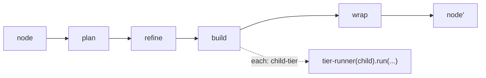

← [engine](_engine.md)

# tier-runner

Drives a node through its four stages `plan → refine → build → wrap`.
**One** function serves all tiers (epic/task/phase) — the only difference is the
`cfg` (from `anchored.yml`) and the `node` (the data). That is the fractal
core.

## What

- `createTierRunner(cfg, deps) → { run(node) → result }`.
- Drives the stages in fixed order and advances the tier status via
  `deps.ops` (forward-only, see [state](../state/_state.md)).
- `phase` is the leaf: its `build` has no `each`, so it runs once
  (real work). For `task`/`epic`, `build` recurses through `each` into the
  child tier.

## How

`createTierRunner(cfg, deps): { run(node: Node) => Promise<Result> }`

## Why

Self-similarity: the same lifecycle form on every tier means *one*
implementation instead of one per tier. New tier = new schema descriptor, no
new runner.
