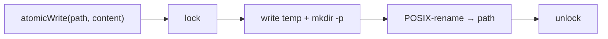

← [core](_core.md)

# io

`atomic-write` — schreibt Node-Files sicher: Lock, `mkdir -p`, dann POSIX-rename.
Ein Einzel-File (kein Ordner).

## Was

- `atomicWrite(path, content)`: schreibt in eine Temp-Datei und benennt sie atomar
  um (rename), so dass nie ein halb-geschriebenes File sichtbar wird.
- `mkdir -p` legt fehlende Eltern-Ordner an (load-bearing für den ersten Write
  unter `.claude/tasks/<epic>/`).
- Cross-Process-Lock schützt vor parallelen Schreibern.

## Wie

