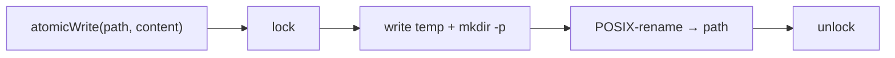

← [core](_core.md)

# io

`atomic-write` — writes Node files safely: lock, `mkdir -p`, then POSIX rename.
A single file (not a folder).

## What

- `atomicWrite(path, content)`: writes to a temp file and renames it atomically
  (rename), so that a half-written file is never visible.
- `mkdir -p` creates missing parent folders (load-bearing for the first write
  under `.claude/tasks/<epic>/`).
- A cross-process lock guards against concurrent writers.

## How

