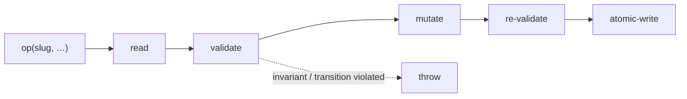

← [core](../_core.md)

# ops

The **tier-generic op core** — the single place that mutates node files.
`createNodeOps(tierSchema, deps)` yields an op surface that works over *every* node
(epic/task/phase); the `tierSchema` parametrizes it. Every mutation
follows `read → validate → mutate → re-validate → atomicWrite`.

| Unit | Responsibility |
|---|---|
| [node-ops](node-ops.md) | The op surface: create/read/status/children/questions/log/evidence — generic over `tierSchema`. |
| [facade](facade.md) | The slug-based `NodeOpsFacade` of the **CLI**: `slug→verb`, read→apply→persist. Holds the await glue. |
| [engine-ops](engine-ops.md) | The `OpsLike` of the **engine**: re-read-before-write, so that worker evidence is never overwritten. |
| [children](scope/children.md) | add/move/**next-child** (dependency-order selection of the next child). |
| [questions](scope/questions.md) | add/resolve question (shared acceptance-criterion/question form). |
| [log](scope/log.md) | append-only log. |

> Outward-readable per-tier surfaces: `anchored task|epic|phase <verb>` — all
> via *this* core. No separate namespace per tier.
