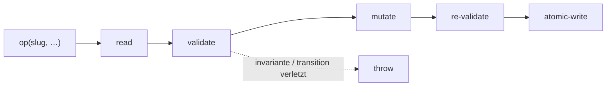

← [core](../_core.md)

# ops

Der **tier-generische Op-Kern** — die einzige Stelle, die Node-Files mutiert.
`createNodeOps(tierSchema, deps)` liefert eine Op-Fläche, die über *jeden* Knoten
(epic/task/phase) funktioniert; der `tierSchema` parametrisiert sie. Jede Mutation
folgt `read → validate → mutate → re-validate → atomicWrite`.

| Unit | Verantwortung |
|---|---|
| [node-ops](node-ops.md) | Die Op-Fläche: create/read/status/children/questions/log/evidence — generisch über `tierSchema`. |
| [children](scope/children.md) | add/move/**next-child** (DAG-Auswahl des nächsten Kindes). |
| [questions](scope/questions.md) | add/resolve question (geteilte AC/Question-Form). |
| [log](scope/log.md) | append-only Log. |

> Nach außen lesbare per-Tier-Surfaces: `anchored task|epic|phase <verb>` — alle
> über *diesen* Kern. Kein separater Namespace pro Tier.
