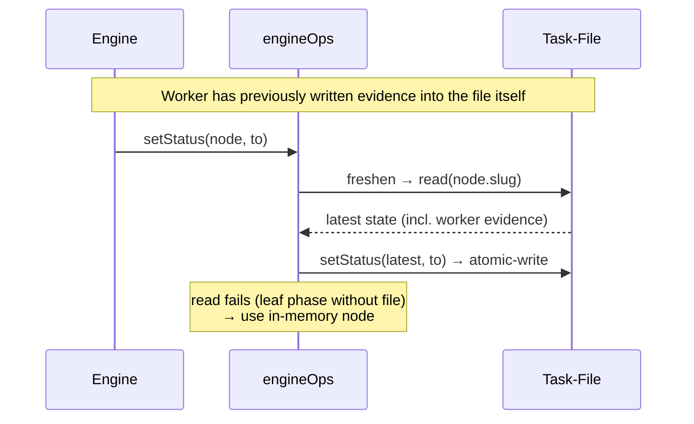

← [ops](_ops.md)

# engine-ops

The **`OpsLike` surface that the [Engine](../engine/_engine.md) uses**, built on
top of the per-tier [node-ops](node-ops.md). Its core trick: **every mutation
re-reads the persisted node first** (`freshen`) before it writes — so the engine
never clobbers the evidence that a worker wrote into the file itself.

## What

- `createEngineOps(opsByTier) → OpsLike` with `setStatus`/`nextChild`/`setChildStatus`/
  `addQuestion`/`resolveQuestion`/`appendLog`.
- **Re-read before every write** (`freshen`): `pick(node).read(node.slug)`. If that
  fails (a leaf `phase` has no file of its own) → fall back to the in-memory node.
- **`tierOfNode(node)`** derives the tier from the child collection: `tasks[]` → epic,
  `phases[]` → task, otherwise task. `pick` uses that to select the right `TierOps`.

## How

## Why

A direct consequence of the [cli-only-transport](../cli/_cli.md) rule: workers write
their evidence **themselves** via the CLI into the file. If the engine wrote its own
in-memory node, it would overwrite those worker writes. The re-read is the seam that
lets both writers coexist — the engine path to the [facade](facade.md) of the CLI
side. Only this await-bearing wiring glue lives here, so that [index.ts](../wiring.md)
stays a pure factory.
