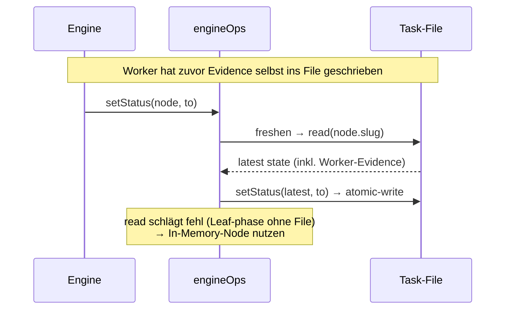

← [ops](_ops.md)

# engine-ops

Die **`OpsLike`-Fläche, die die [Engine](../engine/_engine.md) benutzt**, gebaut über
die per-Tier [node-ops](node-ops.md). Ihr Kern-Trick: **jede Mutation liest den
persistierten Node zuerst neu** (`freshen`), bevor sie schreibt — so klobbert die
Engine nie die Evidence, die ein Worker selbst ins File geschrieben hat.

## Was

- `createEngineOps(opsByTier) → OpsLike` mit `setStatus`/`nextChild`/`setChildStatus`/
  `addQuestion`/`resolveQuestion`/`appendLog`.
- **Re-Read vor jedem Write** (`freshen`): `pick(node).read(node.slug)`. Schlägt das
  fehl (ein Leaf-`phase` hat kein eigenes File) → Fallback auf den In-Memory-Node.
- **`tierOfNode(node)`** leitet den Tier aus der Kind-Collection ab: `tasks[]` → epic,
  `phases[]` → task, sonst task. `pick` wählt damit die richtigen `TierOps`.

## Wie

## Warum

Direkte Folge der [cli-only-transport](../cli/_cli.md)-Regel: Worker schreiben ihre
Evidence **selbst** via CLI ins File. Würde die Engine ihren eigenen In-Memory-Node
schreiben, überschriebe sie diese Worker-Writes. Das Re-Read ist die Naht, die beide
Schreiber koexistieren lässt — der Engine-Pfad zum [facade](facade.md) der CLI-Seite.
Nur diese await-tragende Wiring-Glue lebt hier, damit [index.ts](../wiring.md) reine
Factory bleibt.
