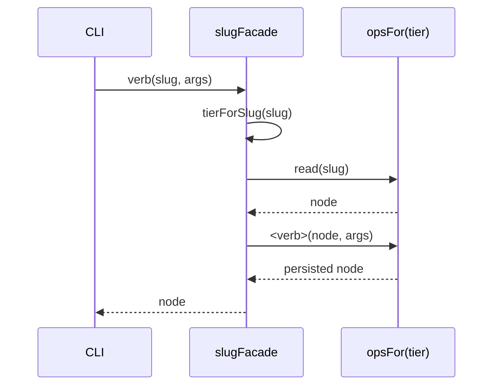

← [ops](_ops.md)

# facade

Die **slug-basierte `NodeOpsFacade`, die die CLI fährt** — eine flache
`slug → verb`-Fläche über den tier-generischen [node-ops](node-ops.md). Jedes Verb
ist *read the node, apply the verb, persist*. Die ganze `await`-tragende Glue lebt
**hier** (nicht in [index.ts](../wiring.md), das eine reine, await-freie
Wiring-Factory bleibt).

## Was

- `createSlugFacade(deps) → NodeOpsFacade`: `create`/`read`/`setStatus`/`addChild`/
  `nextChild`/`addQuestion`/`resolveQuestion`/`appendLog`/`setField`/`setExecutor`/
  `addEvidence`/`addPhase`/`addAc`/`addChildEvidence` — alle slug-keyed.
- **Tier-Auflösung pro Verb:** `tierForSlug(slug)` → der Tier, `opsFor(tier)` → die
  tier-gebundenen `TierOps`. Verb liest den Node, mutiert, persistiert.
- **`create`-Eigenheiten:** Default-Status pro Tier (`defaultStatus`); task/epic
  tragen `schema_version: 2` + `title`, phase-Nodes nicht.
- `setField` routet bewusst durch `node-ops.setField`, damit der Reserved-Field-Guard
  greift.

## Wie

`FacadeDeps`: `{ opsFor(tier), tierForSlug(slug), defaultStatus }`. Die Facade hält
**keinen** State — sie ist die dünne Verb-Schicht; die Mutations-Mechanik (validate →
mutate → re-validate → atomic-write) sitzt in [node-ops](node-ops.md).

## Warum

Die CLI denkt in **Slugs**, der Op-Kern in **Tiers + Nodes**. Diese Facade ist die
Übersetzungsschicht dazwischen — und konzentriert die `await`-Glue an einer Stelle,
damit die Composition-Root ([index.ts](../wiring.md)) rein und fakebar bleibt.
Gegenstück für die Engine-Seite: [engine-ops](engine-ops.md).
