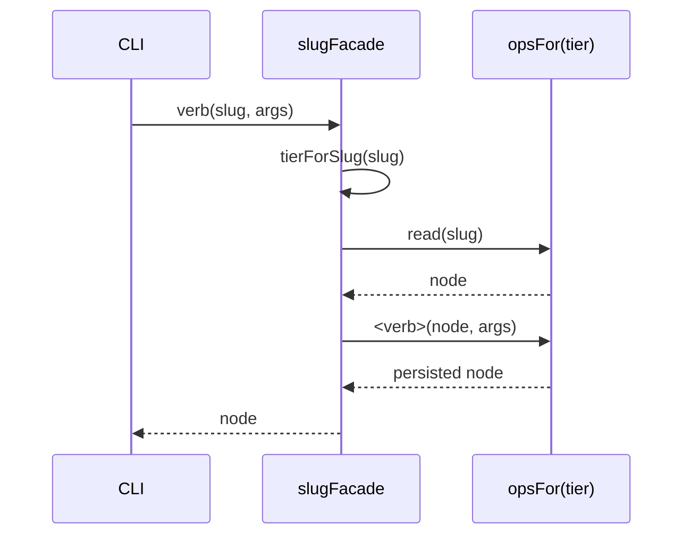

← [ops](_ops.md)

# facade

The **slug-based `NodeOpsFacade` that drives the CLI** — a flat
`slug → verb` surface over the tier-generic [node-ops](node-ops.md). Every verb
is *read the node, apply the verb, persist*. All the `await`-carrying glue lives
**here** (not in [index.ts](../wiring.md), which stays a pure, await-free
wiring factory).

## What

- `createSlugFacade(deps) → NodeOpsFacade`: `create`/`read`/`setStatus`/`addChild`/
  `nextChild`/`addQuestion`/`resolveQuestion`/`appendLog`/`setField`/`setExecutor`/
  `addEvidence`/`addPhase`/`addAc`/`addChildEvidence` — all slug-keyed.
- **Tier resolution per verb:** `tierForSlug(slug)` → the tier, `opsFor(tier)` → the
  tier-bound `TierOps`. The verb reads the node, mutates, persists.
- **`create` specifics:** default status per tier (`defaultStatus`); task/epic
  carry `schema_version: 2` + `title`, phase nodes do not.
- `setField` deliberately routes through `node-ops.setField` so the reserved-field guard
  applies.

## How

`FacadeDeps`: `{ opsFor(tier), tierForSlug(slug), defaultStatus }`. The facade holds
**no** state — it is the thin verb layer; the mutation mechanism (validate →
mutate → re-validate → atomic-write) sits in [node-ops](node-ops.md).

## Why

The CLI thinks in **slugs**, the op core in **tiers + nodes**. This facade is the
translation layer between them — and concentrates the `await` glue in one place,
so the composition root ([index.ts](../wiring.md)) stays pure and fakeable.
Counterpart on the engine side: [engine-ops](engine-ops.md).
