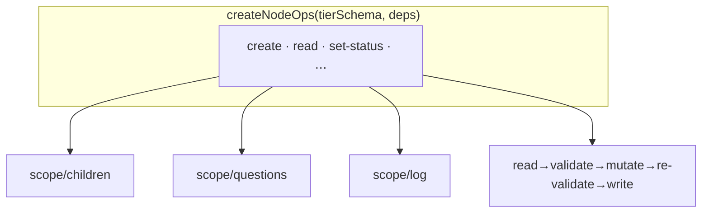

← [ops](_ops.md)

# node-ops

`createNodeOps(tierSchema, deps)` — eine Implementierung der gesamten Op-Fläche,
parametrisiert über den Tier-Schema-Deskriptor. **Eine** Logik bedient task, epic
und phase; sie unterscheiden sich nur im `tierSchema` (Felder + Mechanik).

## Was

- Ops: `create` · `read` · `set-status` · `add-child` · `set-child-status` ·
  `move-child` · `next-child` · `add-question` · `resolve-question` ·
  `append-log` · `set-field` · `add-evidence`.
- Jede mutierende Op: `read → validate → mutate → re-validate → atomicWrite`
  (über [parser](../parser/_parser.md) + [io](../io.md)).
- `set-status`/`add-evidence` ziehen [validate](../validate/_validate.md) —
  Transitions + die harte Invariante (kein `done` ohne `evidence`).
- `tierSchema` liefert: Feld-Shape (config-getrieben), Status-Enum, Transitions,
  Kind-Typ. Die Helfer in `scope/` kapseln children/questions/log.

## Wie

`createNodeOps(tierSchema, deps): { create, read, setStatus, addChild, … }`

## Warum

DRY + ein Wiring-Pfad (eine Factory statt eines Op-Moduls pro Tier). `project`
später = ein weiterer `tierSchema`, keine neue Op-Implementierung. Spiegelt die
Engine-Parametrisierung (`tier-cfg` ↔ `tier-schema`).
