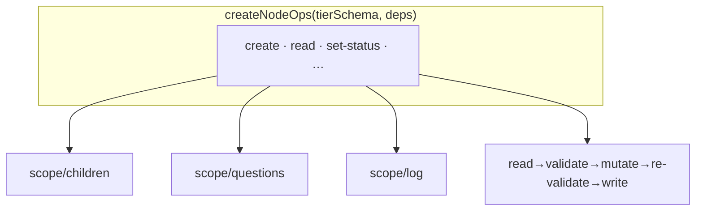

← [ops](_ops.md)

# node-ops

`createNodeOps(tierSchema, deps)` — one implementation of the entire op surface,
parametrized over the tier-schema descriptor. **One** logic serves task, epic
and phase; they differ only in the `tierSchema` (fields + mechanism).

## What

- Ops: `create` · `read` · `set-status` · `add-child` · `set-child-status` ·
  `move-child` · `next-child` · `add-question` · `resolve-question` ·
  `append-log` · `set-field` · `add-evidence`.
- Each mutating op: `read → validate → mutate → re-validate → atomicWrite`
  (via [parser](../parser/_parser.md) + [io](../io.md)).
- `set-status`/`add-evidence` pull in [state](../state/_state.md) —
  transitions + the hard invariant (no `done` without `evidence`).
- `tierSchema` provides: field shape (config-driven), status enum, transitions,
  child type. The helpers in `scope/` encapsulate children/questions/log.

## How

`createNodeOps(tierSchema, deps): { create, read, setStatus, addChild, … }`

## Why

DRY + one wiring path (one factory instead of one op module per tier). `project`
later = one more `tierSchema`, no new op implementation. Mirrors the
engine parametrization (`tier-cfg` ↔ `tier-schema`).
