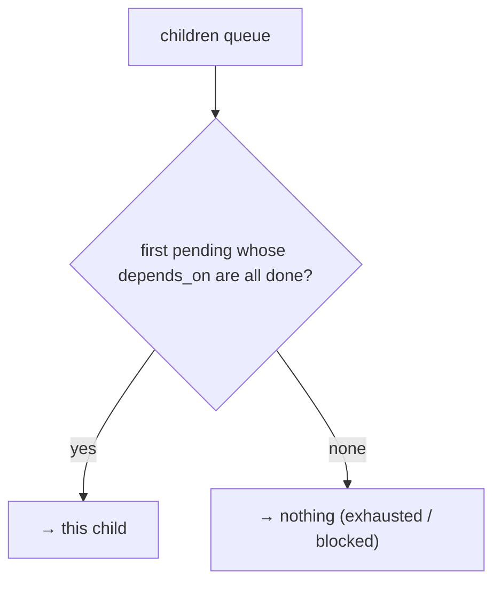

← [ops](../_ops.md)

# children

Manages the children of a node (phases of a task, stubs of an epic):
add, move, and above all **`next-child`** — the dependency-graph selection of which
child comes next.

## What

- `add-child` · `move-child` (order = list position) · `set-child-status`.
- **`next-child`**: the first child with `status: pending` whose `depends_on` are all
  `done`. Returns nothing when the queue is exhausted or all remaining ones are
  blocked.
- `depends_on` references siblings **flatly** (task-local); the nested
  `<epic>/<slug>` form is composed only at the loop call.

## How

## Why

`next-child` is the dependency-graph brain of the `loop` step — one place that decides
order + dependencies, instead of scattering them across the runners. v1 stops at the
first block (sequential); the dependency-graph park comes later.
