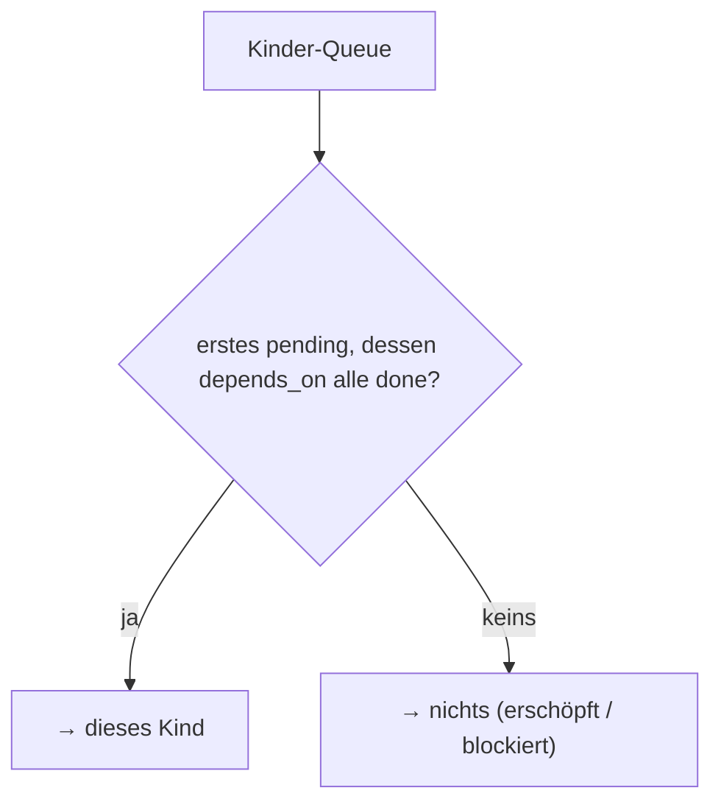

← [ops](../_ops.md)

# children

Verwaltet die Kinder eines Knotens (Phasen einer Task, Stubs eines Epics):
hinzufügen, verschieben, und vor allem **`next-child`** — die DAG-Auswahl, welches
Kind als Nächstes dran ist.

## Was

- `add-child` · `move-child` (Reihenfolge = Listen-Position) · `set-child-status`.
- **`next-child`**: das erste Kind mit `status: pending`, dessen `depends_on` alle
  `done` sind. Liefert nichts, wenn die Queue erschöpft ist oder alle Übrigen
  blockiert sind.
- `depends_on` referenziert Geschwister **flach** (task-lokal); die verschachtelte
  `<epic>/<slug>`-Form wird erst beim Loop-Aufruf komponiert.

## Wie

## Warum

`next-child` ist das DAG-Hirn des `loop`-Steps — eine Stelle, die Reihenfolge +
Abhängigkeiten entscheidet, statt sie über die Runner zu verstreuen. v1 hält beim
ersten Block (sequenziell); DAG-Park kommt später.
