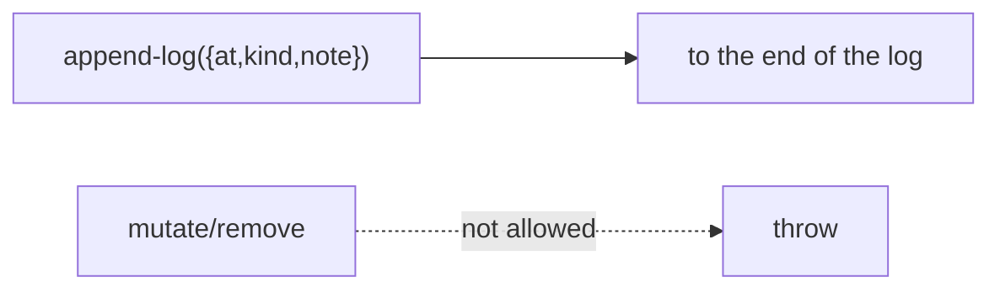

← [ops](../_ops.md)

# log

The **append-only** notebook of a node (primarily the epic PM log). Entries are
only appended, never mutated or removed.

## What

- `append-log` (`{ at, kind, note }`); `kind ∈ decision | reorder | learning |
  blocker` (closed enum).
- Append-only is an **op invariant** (enforced in this op), not in
  [state](../../state/_state.md) — analogous to the append-only context ops.

## How

