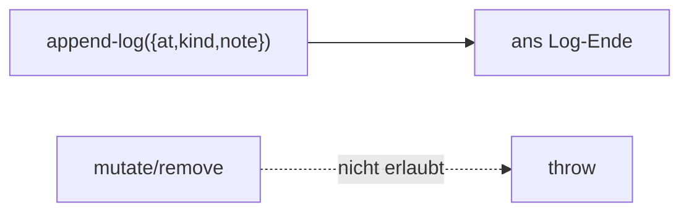

← [ops](../_ops.md)

# log

Das **append-only** Notizbuch eines Knotens (v.a. epic-PM-Log). Einträge werden
nur angehängt, nie mutiert oder entfernt.

## Was

- `append-log` (`{ at, kind, note }`); `kind ∈ decision | reorder | learning |
  blocker` (geschlossenes Enum).
- Append-only ist eine **Op-Invariante** (in dieser Op erzwungen), nicht in
  [validate](../../validate/_validate.md) — analog zu append-only Context-Ops.

## Wie

