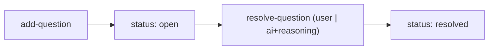

← [ops](../_ops.md)

# questions

Fragen + Antworten auf einem Knoten: hinzufügen und auflösen. Nutzt die
**geteilte** AC/Question-Form (dieselben Typen + sequenzielle ids über alle Tiers).

## Was

- `add-question` (text, priority, origin, optional phase) → sequenzielle id.
- `resolve-question` (id, answer, source `user|ai`, bei `ai` Pflicht-`reasoning`).
- Auflösung mit `source: ai` + `reasoning` bildet den Entscheidungs-Trail
  (von `/a:wrap` reviewbar).

## Wie

