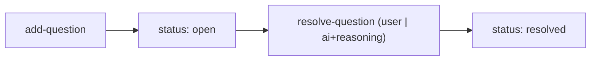

← [ops](../_ops.md)

# questions

Questions + answers on a node: add and resolve. Uses the **shared**
AC/question form (the same types + sequential ids across all tiers).

## What

- `add-question` (text, priority, origin, optional phase) → sequential id.
- `resolve-question` (id, answer, source `user|ai`, with `ai` mandatory `reasoning`).
- Resolution with `source: ai` + `reasoning` forms the decision trail
  (reviewable from `/a:wrap`).

## How

