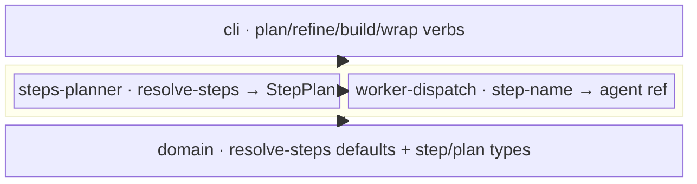

← [core](../_core.md)

# orchestration

The **flow layer**. It turns the config-driven step configuration into a runnable
**plan** and maps each step to the worker that executes it. Sits between `cli`
(above, which exposes the lifecycle verbs and consults the plan) and the
`domain`/`store` substrate (below, which supplies the step grammar + the resolved
defaults). It is pure + deterministic — no I/O, no spawn; the in-session skill is
the orchestrator, this layer is only the menu it reads.

| Area | Responsibility (scope boundary) |
|---|---|
| [steps-planner](steps-planner/steps-planner.md) | `createStepsPlanner(config)` → `plan(tier, stage)`: resolves the ordered step sequence and classifies each step into a `PlanStep` (`worker` / `run` / `loop`). |
| [worker-dispatch](worker-dispatch/worker-dispatch.md) | `createWorkerDispatch(overrides)`: maps a step name → its worker ref (`agent`/`skill`). `DEFAULT_WORKERS` is config-driven data, spread-merged with overrides — never hardwired in the engine. |

> **YAGNI**: reflects the already-decided flow design only. Both units are pure
> closures over the merged `effectiveConfig`; deeper detail follows the code.
