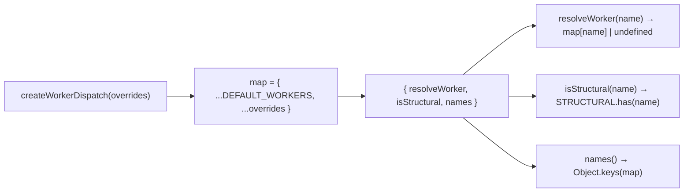

← [orchestration](../_orchestration.md)

# worker-dispatch

`createWorkerDispatch(overrides = {})` maps a built-in step **name** to its
**worker ref** (a plugin agent or a skill). The single place that knows the
step-name → worker mapping; the engine never hardcodes step names. Workers
themselves are plugin agents (Task plugin-agents) — here it is only the
name → ref lookup.

## What

- `WorkerRef = { type: 'agent' | 'skill', ref: string }`.
- `DEFAULT_WORKERS` is a plain data record mapping each built-in step name to its
  ref — e.g. `implement → { agent, build-implement }`, `walk → { skill, walk }`
  (skill-routing, not an agent), `roll-up → { agent, epic-roll-up }`. It is
  **data, not hardwired logic**: the factory builds its map as
  `{ ...DEFAULT_WORKERS, ...overrides }`, so a caller can override or extend any
  entry.
- `STRUCTURAL = Set('loop', 'run')` — the structural built-ins the engine handles
  itself, never dispatched as workers.
- The factory returns three methods:
  - `resolveWorker(stepName) → WorkerRef | undefined` — map lookup (undefined when
    unknown).
  - `isStructural(stepName) → boolean` — membership in `STRUCTURAL`.
  - `names() → string[]` — all known worker names (default ∪ overrides).

## How

Usage: `createWorkerDispatch().resolveWorker('implement')` →
`{ type: 'agent', ref: 'build-implement' }`.

## Why

Mechanism vs. policy: the engine dispatches config-driven and knows no concrete
step names. Centralising the name → agent mapping as injectable data keeps the
roster swappable (override a worker in tests or a custom setup) and the structural
built-ins (`loop`/`run`) cleanly separated from worker steps.
