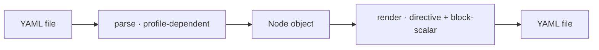

← [core](../_core.md)

# parser

YAML ↔ Node. Reads Node files + `anchored.yml` and renders Nodes back —
with two **parse profiles** and a render contract (schema directive +
block-scalar for prose).

| Unit | Responsibility |
|---|---|
| [parse](parse.md) | YAML → Node. Two profiles: Node files no-alias (injection guard), `anchored.yml` alias-ok (for `_lib`). |
| [render](render.md) | Node → YAML: schema directive line 1 + block-scalar (`|`) for Markdown prose. |
