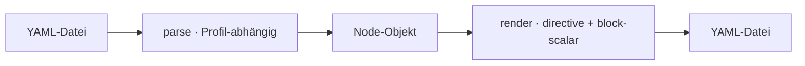

← [core](../_core.md)

# parser

YAML ↔ Node. Liest Node-Files + `anchored.yml` ein und rendert Nodes zurück —
mit zwei **Parse-Profilen** und einem Render-Contract (Schema-Directive +
block-scalar für Prosa).

| Unit | Verantwortung |
|---|---|
| [parse](parse.md) | YAML → Node. Zwei Profile: Node-Files no-alias (Injection-Guard), `anchored.yml` alias-ok (für `_lib`). |
| [render](render.md) | Node → YAML: Schema-Directive Zeile 1 + block-scalar (`|`) für Markdown-Prosa. |
