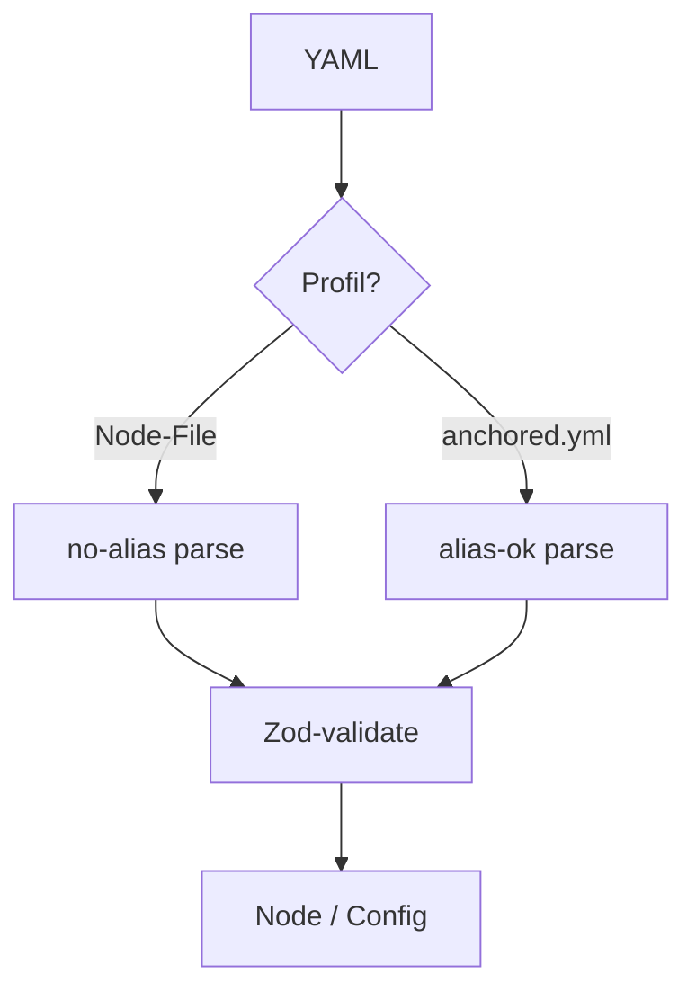

← [parser](_parser.md)

# parse

YAML → Node-Objekt, anschließend gegen das passende Schema validiert. **Zwei
Profile**, weil die beiden Datei-Arten unterschiedliche Sicherheits-Ansprüche
haben.

## Was

- **Node-Files** (task/epic) → **no-alias**: YAML-Anchors/Aliasse sind geblockt
  (Injection-Guard), weil diese Files (teils maschinell) breit verarbeitet werden.
- **`anchored.yml`** → **alias-ok**: Anchors erlaubt, damit `_lib` wiederverwendbar
  ist — user-authored Config, kein untrusted Input.
- Nach dem Parse: Zod-Validierung gegen [schema](../schema/_schema.md).

## Wie

