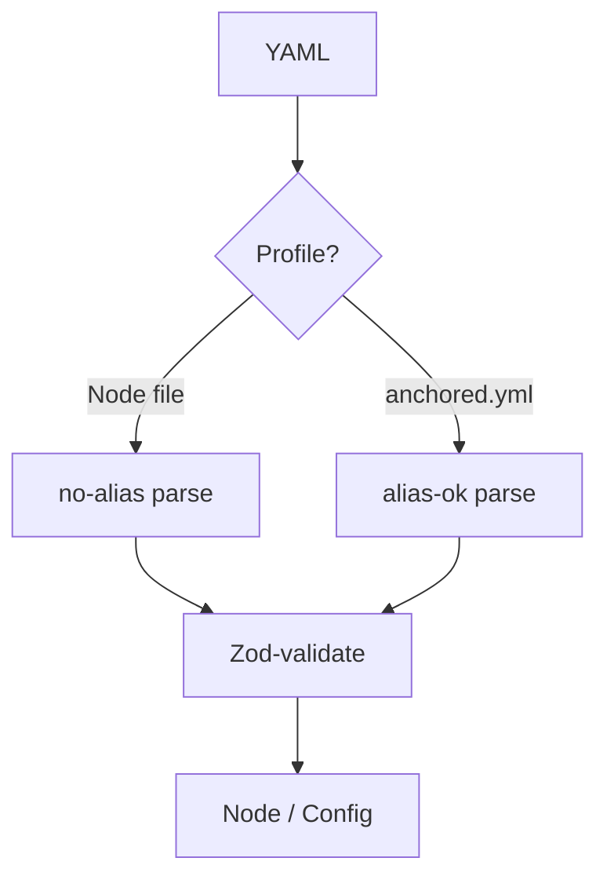

← [parser](_parser.md)

# parse

YAML → node object, then validated against the matching schema. **Two
profiles**, because the two file kinds have different security requirements.

## What

- **Node files** (task/epic) → **no-alias**: YAML anchors/aliases are blocked
  (injection guard), because these files are processed broadly (partly by machine).
- **`anchored.yml`** → **alias-ok**: anchors allowed, so that `_lib` is reusable
  — user-authored config, not untrusted input.
- After the parse: Zod validation against [schema](../schema/_schema.md).

## How

