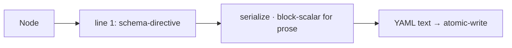

← [parser](_parser.md)

# render

Node object → YAML. Holds the serialization contract: the schema directive as
line 1 (IDE validation) and block-scalar (`|`) for prose fields.

## What

- Line 1: `# yaml-language-server: $schema=…` — auto-injected on *every*
  write, not by hand.
- Prose fields (`context.*`, logs, `goal`) as block-scalar (`|`) — Markdown
  stays readable, no "mix" problem (it's a normal multi-line YAML string).
- Deterministic field order (stable diffs).

## How

