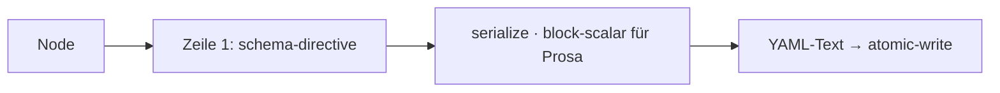

← [parser](_parser.md)

# render

Node-Objekt → YAML. Hält den Serialisierungs-Contract: die Schema-Directive als
Zeile 1 (IDE-Validierung) und block-scalar (`|`) für Prosa-Felder.

## Was

- Zeile 1: `# yaml-language-server: $schema=…` — auto-injiziert bei *jedem*
  Write, nicht von Hand.
- Prosa-Felder (`context.*`, Logs, `goal`) als block-scalar (`|`) — Markdown
  bleibt lesbar, kein „Mix"-Problem (ist ein normaler mehrzeiliger YAML-String).
- Deterministische Feld-Reihenfolge (stabile Diffs).

## Wie

