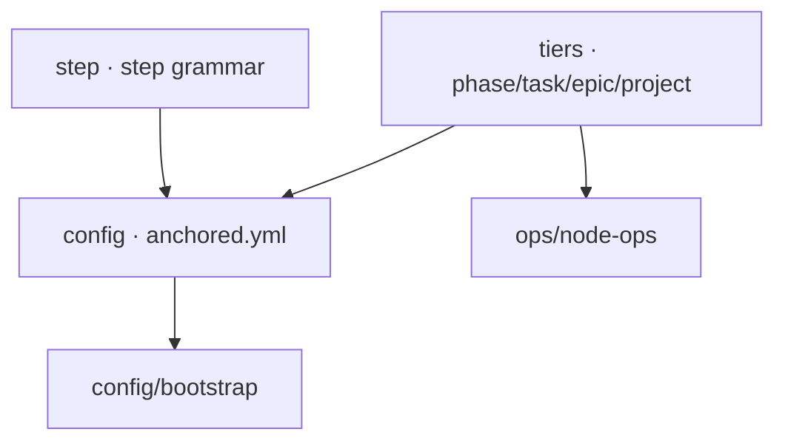

← [core](../_core.md)

# schema

The **Zod schemas** — the structural truth about steps, the `anchored.yml`
and the tier descriptors. Structural means: shape + hard constraints; the
*built-in semantics* (order, injection) deliberately live elsewhere
([resolve-steps](../engine/scope/resolve-steps.md)).

| Unit | Responsibility |
|---|---|
| [step](step.md) | The step grammar: `name` + (`run` XOR `use`+`type`) + `instructions`; `involve`/`each`. |
| [config](config.md) | The `anchored.yml` schema: tiers, `_lib`, custom `fields`, top-level strict. |
| [tiers](tiers.md) | The tier descriptors — field shape (config) + mechanics (status, transitions, child type). |
