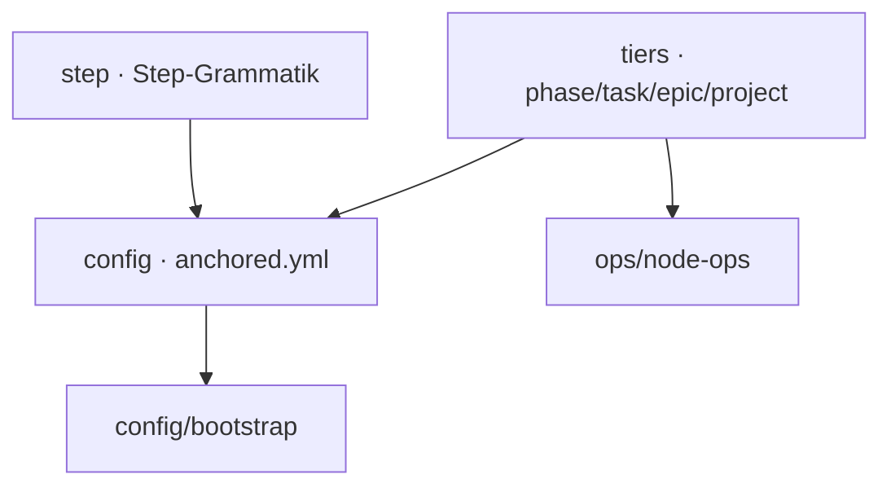

← [core](../_core.md)

# schema

Die **Zod-Schemas** — die strukturelle Wahrheit über Steps, die `anchored.yml`
und die Tier-Deskriptoren. Strukturell heißt: Form + harte Constraints; die
*Built-in-Semantik* (Reihenfolge, Injektion) lebt bewusst woanders
([resolve-steps](../engine/scope/resolve-steps.md)).

| Unit | Verantwortung |
|---|---|
| [step](step.md) | Die Step-Grammatik: `name` + (`run` XOR `use`+`type`) + `instructions`; `involve`/`each`. |
| [config](config.md) | Das `anchored.yml`-Schema: Tiers, `_lib`, custom `fields`, top-level strict. |
| [tiers](tiers.md) | Die Tier-Deskriptoren — Feld-Shape (config) + Mechanik (Status, Transitions, Kind-Typ). |
