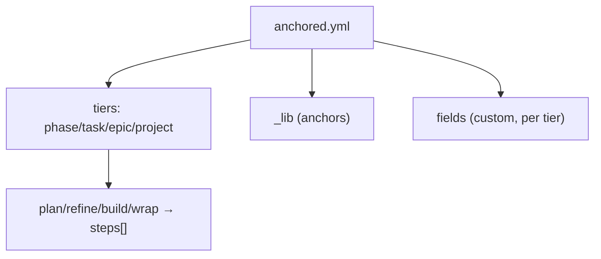

← [schema](_schema.md)

# config

The schema of `anchored.yml` — the shape of the file loaded + merged at bootstrap.
Tiers with stages, plus the `_` buckets.

## What

- Top-level: the tiers (`phase`/`task`/`epic`/`project`), each with stages
  (`plan`/`refine`/`build`/`wrap`), each a `steps` list ([step](step.md)).
- `build` additionally carries `each` (intrinsic), `stop`, `retry_limit` as
  siblings of `steps`.
- `_lib` (YAML anchors **allowed** on this parse profile) + custom `fields` per
  tier. Top-level **strict** (unknown keys → error).

## How

## Why

The user file is minimal (deltas only); the default base comes from the
default-template. Two parse profiles (`anchored.yml` alias-ok, node files
no-alias) — see [parser](../parser/_parser.md).
