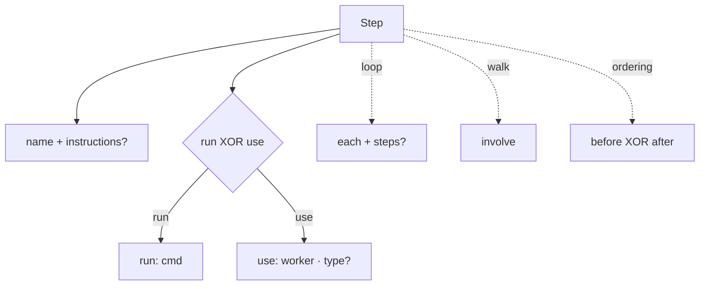

← [schema](_schema.md)

# step

The **step grammar** — deliberately structural. A step is the smallest unit of a
stage; the schema enforces only the form, not the built-in meaning.

## What

- `name` (required) + optional `instructions` — the latter allowed on **every**
  step type (run/use/worker): prose that the skill follows when executing/dispatching
  (uniform, no special case).
- Exactly one: `run: '<cmd>'` **XOR** `use: '<worker>'` (+ optional
  `type: agent|skill`). Enforced via Zod refinement.
- `involve: all|high-only|none` — only on `walk`.
- `each: <tier>` + optional `steps` body — on `loop`.
- `before: '<step>'` **XOR** `after: '<step>'` — positions the step relative to
  a named other step (at most one, via refinement).
- **Reserved-name semantics** (built-in dispatch, canonical order, injection)
  is *not* here, but in
  [resolve-steps](../engine/scope/resolve-steps.md).

## How

## Why

Keeping it structural + generic makes the schema reusable; the registry-dependent
checks (order, injection) need their own pass anyway and don't belong in the
per-step object.
