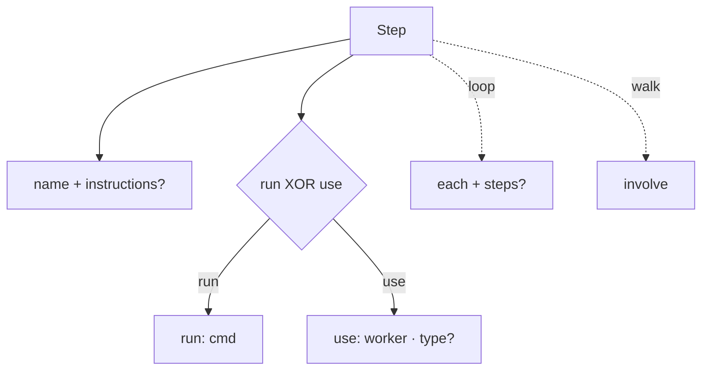

← [schema](_schema.md)

# step

Die **Step-Grammatik** — bewusst strukturell. Ein Step ist die kleinste Einheit
einer Stage; das Schema erzwingt nur die Form, nicht die Built-in-Bedeutung.

## Was

- `name` (Pflicht) + optional `instructions`.
- Genau eines: `run: '<cmd>'` **XOR** `use: '<worker>'` (+ optional
  `type: agent|skill`). Per Zod-Refinement erzwungen.
- `involve: all|high-only|none` — nur am `walk`.
- `each: <tier>` + optionaler `steps`-Body — am `loop`.
- **Reserved-Name-Semantik** (Built-in-Dispatch, kanonische Reihenfolge,
  Injektion) ist *nicht* hier, sondern in
  [resolve-steps](../engine/scope/resolve-steps.md).

## Wie

## Warum

Strukturell + generisch zu halten macht das Schema wiederverwendbar; die
registry-abhängigen Checks (Reihenfolge, Injektion) brauchen ohnehin einen
eigenen Pass und gehören nicht ins Per-Step-Objekt.
