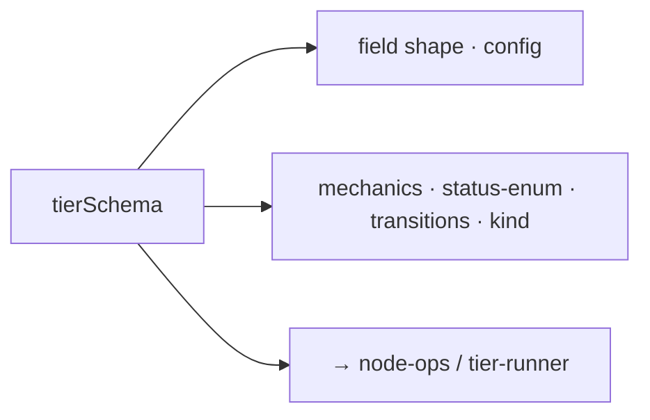

← [schema](_schema.md)

# tiers

The **tier descriptors** — what makes up a tier (phase/task/epic/project).
Each descriptor = **field shape** (config-driven) + **mechanics** (code-fixed).
[node-ops](../ops/node-ops.md) and the [tier-runner](../engine/tier-runner.md)
are parametrized with them.

## What

- **Field shape** (policy, merged from `anchored.yml` + default template): which
  fields the node carries. The complete default fields per tier are in
  [docs/design/anchored.default.yml](../../design/anchored.default.yml).
- **Mechanics** (fixed, code): status enum, [transitions](../state/_state.md),
  child type (task→phase, epic→task, project→epic; phase = leaf, no child).
- Quick overview:

| Tier | Status enum | Child |
|---|---|---|
| phase | pending · in-progress · done · blocked · deferred | — (leaf) |
| task | plan · drafted · refined · build · wrap · done | phase |
| epic | planning · building · done | task |
| project | *(reserved)* | epic |

## How

> The exhaustive field lists per tier are micro — deliberately not duplicated
> here, but in the default-config spec.
