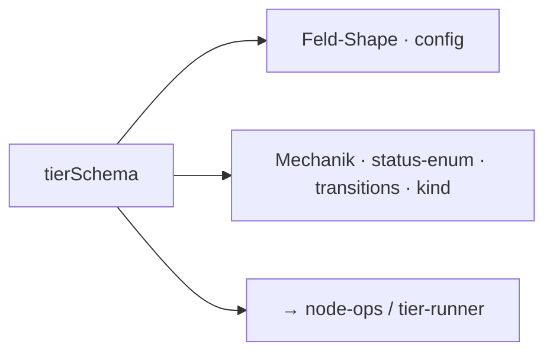

← [schema](_schema.md)

# tiers

Die **Tier-Deskriptoren** — was eine Etage (phase/task/epic/project) ausmacht.
Jeder Deskriptor = **Feld-Shape** (config-getrieben) + **Mechanik** (Code-fix).
[node-ops](../ops/node-ops.md) und der [tier-runner](../engine/tier-runner.md)
werden damit parametrisiert.

## Was

- **Feld-Shape** (Policy, aus `anchored.yml` + Default-Template gemerged): welche
  Felder der Node trägt. Die vollständigen Default-Felder pro Tier stehen in
  [docs/design/anchored.default.yml](../../design/anchored.default.yml).
- **Mechanik** (fix, Code): Status-Enum, [Transitions](../state/_state.md),
  Kind-Typ (task→phase, epic→task, project→epic; phase = Leaf, kein Kind).
- Kurzüberblick:

| Tier | Status-Enum | Kind |
|---|---|---|
| phase | pending · in-progress · done · blocked · deferred | — (Leaf) |
| task | plan · drafted · refined · build · wrap · done | phase |
| epic | planning · building · done | task |
| project | *(reserviert)* | epic |

## Wie

> Die erschöpfenden Feldlisten pro Tier sind micro — bewusst nicht hier
> dupliziert, sondern in der Default-Config-Spec.
