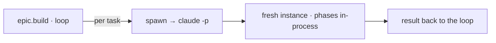

← [core](_core.md)

# spawn

The **execution substrate** — the `spawn` dep through which [worker-step](engine/scope/worker-step.md)
triggers AI work. Default: headless `claude -p` per task-file. A single file.

## What

- `spawn(worker, input)` → starts a **fresh `claude -p` instance per
  task-file**; that task's phases run *in-process* in this instance
  (nesting capped at ~2).
- Cross-task context (e.g. epic-log excerpt) is passed as an argument —
  `/a:plan` (task) stays epic-blind.
- Injected seam: an in-process task-subagent mode (live progress) can be added
  later as a second implementation, without changing the runners.

## How

## Why

Headless makes anchored autonomous + CI-/cron-capable (fire-and-forget) and is
trivially fakeable in tests (shell-out). Per task instead of per phase keeps cost +
process depth in check.
