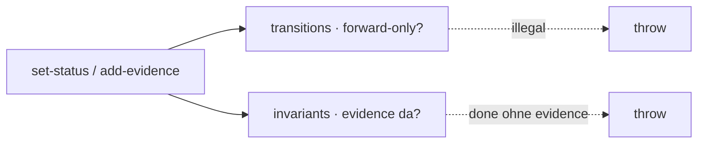

← [core](../_core.md)

# state

Die **Substrat-Mechanik**, die Integrität erzwingt: die forward-only
State-Machine + die harte Invariante. Beides greift in den mutierenden
[ops](../ops/_ops.md), nicht in einem Step — so kann es kein Config weg-schalten.

| Unit | Verantwortung |
|---|---|
| [transitions](transitions.md) | Per-Tier forward-only State-Machine + `assertTransition`. |
| [invariants](invariants.md) | Die harte Invariante: kein `done` ohne `evidence`. Anchoreds Versprechen. |
