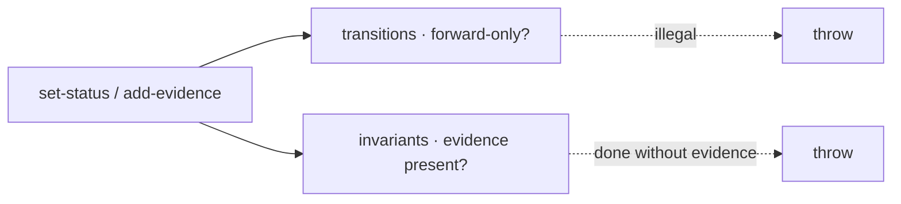

← [core](../_core.md)

# state

The **substrate mechanism** that enforces integrity: the forward-only
state machine + the hard invariant. Both hook into the mutating
[ops](../ops/_ops.md), not into a step — so no config can switch it off.

| Unit | Responsibility |
|---|---|
| [transitions](transitions.md) | Per-tier forward-only state machine + `assertTransition`. |
| [invariants](invariants.md) | The hard invariant: no `done` without `evidence`. Anchored's promise. |
