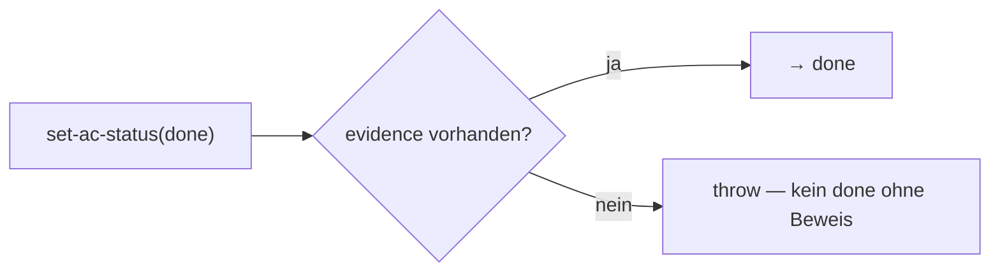

← [state](_state.md)

# invariants

Die **harte Invariante** — anchoreds Versprechen, im Datenmodell verankert: ein
`ac` (Acceptance Criterion) geht nur auf `done`, wenn `evidence` vorliegt. *Wie*
die Evidence entsteht, ist frei konfigurierbar — aber das Substrat lässt nicht
über „fertig" lügen.

## Was

- Greift in `set-ac-status`/`add-evidence` ([node-ops](../ops/node-ops.md)):
  `ac.status = done` ohne ≥1 `evidence`-Eintrag → throw.
- **Nicht abschaltbar** — sitzt im Code, nicht in einem (überschreibbaren) Step.
  Das ist die Mechanismus-Seite der Mechanismus/Policy-Trennung.
- Validatoren (`task-validate`/`code-validate`) *erzeugen/prüfen* Evidence; die
  Invariante *erzwingt* nur ihre Existenz — beides ergänzt sich.

## Wie

## Warum

Macht „alles ist konfigurierbar / keine Built-ins" wahr, **ohne** die USP zu
verlieren: die Garantie hängt nicht an einem Step, der entfernt werden könnte,
sondern an der Daten-Transition selbst.
