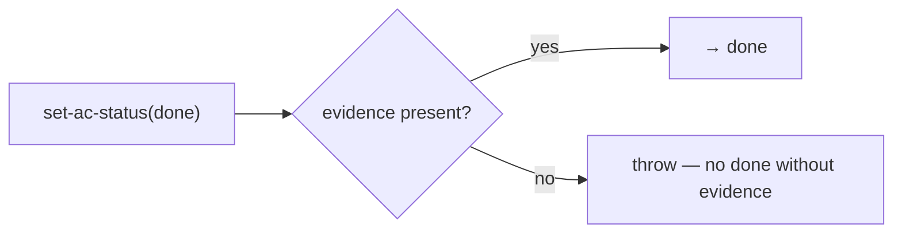

← [state](_state.md)

# invariants

The **hard invariant** — anchored's promise, anchored in the data model: an
`ac` (acceptance criterion) only goes to `done` when `evidence` is present. *How*
the evidence comes about is freely configurable — but the substrate does not let
anyone lie about being "done".

## What

- Triggers in `set-ac-status`/`add-evidence` ([node-ops](../ops/node-ops.md)):
  `ac.status = done` without ≥1 `evidence` entry → throw.
- **Not switchable off** — it sits in the code, not in a (overridable) step.
  This is the mechanism side of the mechanism/policy split.
- Validators (`task-validate`/`code-validate`) *produce/check* evidence; the
  invariant only *enforces* its existence — the two complement each other.

## How

## Why

Makes "everything is configurable / no built-ins" true **without** losing the
core value: the guarantee does not hang on a step that could be removed, but on
the data transition itself.
