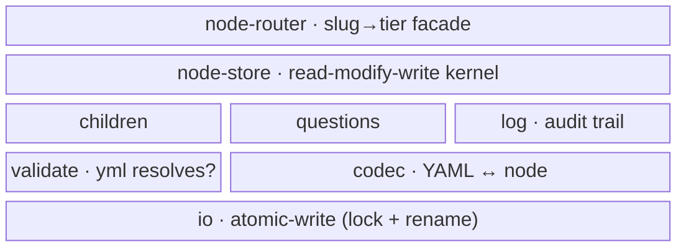

← [core](../_core.md)

# store

The **mechanism layer** — the persist + mutate heart of anchored. Everything that
turns a node file into a typed object, mutates it under the hard invariant, and
writes it back atomically lives here. It is **deterministic code** (mechanism, not
policy): the read-modify-write kernel, the slug→tier router, the validation
surface, the YAML↔node codec, and the atomic-write IO. It sits **below**
orchestration/cli (which drives it through the facade) and **above** the domain
(`transitions`, `invariants`, `tiers`, `lifecycle/stages`), which it imports as
pure substrate functions.

| Area | Responsibility (scope boundary) |
|---|---|
| [node-store](node-store/_node-store.md) | The read-modify-write **kernel** — `createNodeOps(tierSchema, deps)`, one tier-generic op core. Every mutation validates + persists under the hard invariant + forward-only transitions. |
| [node-router](node-router/_node-router.md) | The slug→tier→op **router** — `createSlugFacade(deps)`. Flat slug-verb surface the CLI drives; derives a node's tier from file shape, owns the await glue. Defines the `NodeOpsFacade` type. |
| [children](children/children.md) | Pure child-list helpers — `nextChild` / `readyChildren` (dependency-aware), `addChild` / `moveChild`. Drives the sequential build loop + the epic fan-out batch. |
| [questions](questions/questions.md) | Pure Q&A helpers — `addQuestion` (sequential id) / `resolveQuestion` (decision-trail invariant: an AI answer must carry reasoning). |
| [log](log.md) | Append-only audit trail — `appendLog`. An entry is only ever appended, never mutated or removed. Single file. |
| [validate](validate/validate.md) | `anchored validate` — proves the merged `anchored.yml` resolves across every tier×stage; reports the resolved step shape + custom fields. |
| [codec](codec/_codec.md) | The YAML↔node codec — `parse/` (YAML → typed node, two profiles) + `render/` (node → YAML + schema directive). The roundtrip is spec-locked. |
| [io](io/io.md) | `createIo(deps)` — atomic-write substrate: `mkdir -p` → lock → temp-write → POSIX rename → release, plus compare-and-swap, `move`, `remove`. |

> **Mechanism vs. policy**: everything here is **mechanism** — the guarantees that
> must never break (atomic write, forward-only transition, no `done` without
> `evidence`). The *what-happens-per-stage* (step sequences, fields) is policy and
> lives in the config/template, not here.
